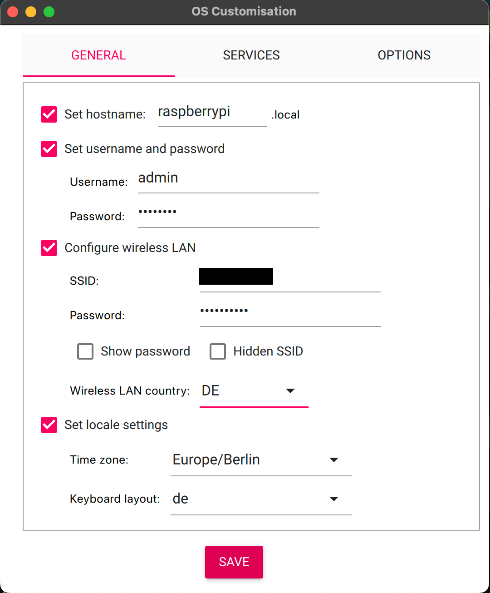

# lava-vtt

A virtual table-top, that is first and foremost designed to be:

-   used for non-virtual or in-person play, to enhance the playing experience of your favourite TTRPG.
-   integrated closely with obsidian.md, since that is, what we are using for DMing.

## Running the App

Installing dependencies

```bash
npm install
```

Running the apps

```bash
docker compose up -d mongo

nx serve client
nx serve server
```

Afterward, the app is reachable at `http://localhost:3000`.

---

## Obsidian Plugin

Compiling the plugin

```bash
nx run obsidian-lava-vtt-adapter:dev
```

---

## Raspberry Pi Setup

This section outlines the steps required to transform a Raspberry Pi
into a smart, QR-code-reading client for lava-vtt.

The Raspberry Pi must be equipped with a camera module.
Upon starting, the Pi will prompt the user, through the camera,
to scan two QR codes: one for connecting to a Wi-Fi network (if it does not
have a network connection) and another
for a lava-vtt server URL. Once both QR codes have been successfully scanned,
the Raspberry Pi will launch a web browser to display the website
specified by the URL. This method is perfect for those looking to
use a Raspberry Pi as a portable lava-vtt client.

The URL presented in QR code form as the lava-vtt server must be in the format
`lava=SERVER_HOSTNAME`. You will also find the lava-vtt server QR code in the
lava-vtt admin interface.

### Raspberry Pi Imager

-   Download Raspberry Pi Imager
-   Insert SD Card
-   Start Raspberry Pi Imager
    -   Select the fitting Raspberry device
    -   OS: Raspberry Pi OS (Legacy, 32-bit)
    -   Select SD storage
-   Setup Raspberry Pi:
    -   Make sure to call the user "admin"
        -   Configuring Wi-Fi is optional but recommended



-   Wait for the installation to finish

### Raspberry Pi

-   Insert SD card into Raspberry
-   Connect the camera module
-   Connect a screen + mouse + keyboard (mouse + keyboard only needed for first time setup)
-   Boot the Raspberry
-   Run the setup script:

```
curl -s https://raw.githubusercontent.com/lavaforge/lava-vtt/main/scripts/setup.sh | sudo bash
```

-   After the script is finished the Raspberry Pi will reboot
-   The start script is then located in `/lava`
-   The start script now also starts automatically on boot

When the Raspberry Pi is started in a new location where it
does not have a Wi-Fi connection you will be prompted to show
a Wi-Fi QR code. This way you won't have to carry a keyboard
when taking the Raspberry Pi client somewhere else.
